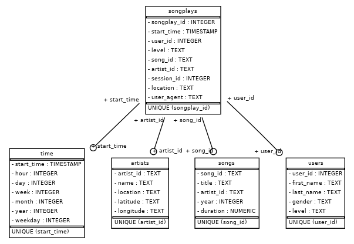

# Project: Data Modeling with Postgres

## Introduction

A startup called Sparkify wants to analyze the data they've been collecting on songs and user activity on their new music streaming app. The analytics team is particularly interested in understanding what songs users are listening to. Currently, they don't have an easy way to query their data, which resides in a directory of JSON logs on user activity on the app, as well as a directory with JSON metadata on the songs in their app.

They'd like a data engineer to create a Postgres database with tables designed to optimize queries on song play analysis, and bring me on the project. My role was to create a database schema and ETL pipeline for this analysis. I was able to test database and ETL pipeline by running queries given to me by the analytics team from Sparkify and compared mt  results with their expected results.

## Project Description
In this project, I applied what I've learned on data modeling with Postgres and built an ETL pipeline using Python. To complete the project, I defined fact and dimension tables for a star schema for a particular analytic focus, and wrote an ETL pipeline that transfered data from files in two local directories into these tables in Postgres using Python and SQL.

## Data Sets

### Song Dataset

The first dataset is a subset of real data from the [Million Song Dataset](https://labrosa.ee.columbia.edu/millionsong/). Each file is in JSON format and contains metadata about a song and the artist of that song. The files are partitioned by the first three letters of each song's track ID. For example, here are filepaths to two files in this dataset.

```
song_data/A/B/C/TRABCEI128F424C983.json
song_data/A/A/B/TRAABJL12903CDCF1A.json
```

And below is an example of what a single song file, TRAABJL12903CDCF1A.json, looks like.

```
{"num_songs": 1, "artist_id": "ARJIE2Y1187B994AB7", "artist_latitude": null, "artist_longitude": null, "artist_location": "", "artist_name": "Line Renaud", "song_id": "SOUPIRU12A6D4FA1E1", "title": "Der Kleine Dompfaff", "duration": 152.92036, "year": 0}
```

## Schema for Song Play Analysis

Using the song and log datasets, I created a star schema optimized for queries on song play analysis. This includes the following tables.

* Fact Table
 1. **songplays** - records in log data associated with song plays i.e. records with page `NextSong`

    Columns: songplay_id, start_time, user_id, level, song_id, artist_id, session_id, location, user_agent
    
* Dimension Tables
 1. **users** - users in the app
 
    Columns: user_id, first_name, last_name, gender, level
 1. **songs** - songs in music database
 
    Columns: song_id, title, artist_id, year, duration
 1. **artists** - artists in music database
 
    Columns: artist_id, name, location, latitude, longitude
 1. **time** - timestamps of records in songplays broken down into specific units
 
    Columns: start_time, hour, day, week, month, year, weekday
    
  
## Project Structure:

1. [test.ipynb](./test.ipynb) displays the first few rows of each table to let you check your database.
1. [create_tables.py](./create_tables.py) drops and creates your tables. You run this file to reset your tables before each time you run your ETL scripts.
1. [etl.ipynb](./etl.ipynb) reads and processes a single file from song_data and log_data and loads the data into your tables. This notebook contains detailed instructions on the ETL process for each of the tables.
1. [etl.py](./etl.py) reads and processes files from song_data and log_data and loads them into your tables. You can fill this out based on your work in the ETL notebook.
1. [sql_queries.py](./sql_queries.py) contains all your sql queries, and is imported into the last three files above.
README.md provides discussion on your project.

## How to Run the Scripts

### Requisites

* You must have a running Postgresql instance configured as follows:

| Parameter  | Value |
| ------------- |:-------------:|
| Host      | localhost     |
| Database      | studentdb     |
| User      | student     |
| Password      | student     |

* You must have a Python 3.6+ installed.

For convenience, we've provided a [docker-compose file](../docker-compose.yml) with these requirements.

### Running

In a terminal:

1. create tables:

`python create_tables.py`

2. execute the ETL process:

`python etl.py`


## Some Analytic Queries Examples

### What is the total of free and paid users by gender?

```
SELECT u.gender, u.level, count(*) total FROM songplays s JOIN users u ON (s.user_id = u.user_id) GROUP BY u.gender, u.level;
```

| gender | level | total|
|--------|-------|:----:|
| M      | free  | 855  |   
| F      | free  | 876  |
| M      | paid  | 1078 |
| F      | paid  | 4011 |

### Does the week day has some influence on our audience?

```
SELECT CASE t.weekday
         WHEN 0 THEN 'Monday'
         WHEN 1 THEN 'Tuesday'
         WHEN 2 THEN 'Wednesday'
         WHEN 3 THEN 'Thursday'
         WHEN 4 THEN 'Friday'
         WHEN 5 THEN 'Saturday'
         WHEN 6 THEN 'Sunday' 
         END weekday, count(*) total FROM songplays s JOIN time t ON (t.start_time = s.start_time) GROUP BY t.weekday ORDER BY t.weekday;
```

| weekday   | total|
|-----------|:-----:|
| Monday    | 1014  |
| Tuesday   | 1071  |
| Wednesday | 1364  | 
| Thursday  | 1052  |
| Friday    | 1295  |
| Saturday  | 628   |
| Sunday    | 396   |