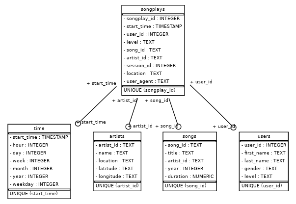

# Project: Data Modeling with Postgres

## Introduction

A music streaming startup, Sparkify, has grown their user base and song database and want to move their processes and data onto the cloud. Their data resides in S3, in a directory of JSON logs on user activity on the app, as well as a directory with JSON metadata on the songs in their app.

As their data engineer, my task was to build an ETL pipeline that extracted their data from S3, staged them in Redshift, and transformed data into a set of dimensional tables for their analytics team to continue finding insights in what songs their users are listening to. I was able to test my database and ETL pipeline by running queries given to me by the analytics team from Sparkify and compared my results with their expected results.

## Project Description

In this project, I've applied what I've learned on data warehouses and AWS to build an ETL pipeline for a database hosted on Redshift. To complete the project, I needed to load data from S3 to staging tables on Redshift and executed SQL statements that created the analytics tables from these staging tables.

## Data Sets

### Song Dataset

The first dataset is a subset of real data from the [Million Song Dataset](https://labrosa.ee.columbia.edu/millionsong/). Each file is in JSON format and contains metadata about a song and the artist of that song. The files are partitioned by the first three letters of each song's track ID. For example, here are filepaths to two files in this dataset.

```
song_data/A/B/C/TRABCEI128F424C983.json
song_data/A/A/B/TRAABJL12903CDCF1A.json
```

And below is an example of what a single song file, TRAABJL12903CDCF1A.json, looks like.

```
{"num_songs": 1, "artist_id": "ARJIE2Y1187B994AB7", "artist_latitude": null, "artist_longitude": null, "artist_location": "", "artist_name": "Line Renaud", "song_id": "SOUPIRU12A6D4FA1E1", "title": "Der Kleine Dompfaff", "duration": 152.92036, "year": 0}
```

## Schema for Song Play Analysis

Using the song and log datasets, I created a star schema optimized for queries on song play analysis. This includes the following tables.

* Fact Table
 1. **songplays** - records in log data associated with song plays i.e. records with page `NextSong`

    Columns: songplay_id, start_time (sortkey), user_id (distkey), level, song_id, artist_id, session_id, location, user_agent
    
* Dimension Tables
 1. **users** - users in the app
 
    Columns: user_id, first_name, last_name, gender, level
 1. **songs** - songs in music database
 
    Columns: song_id, title, artist_id (distkey), year, duration
 1. **artists** - artists in music database
 
    Columns: artist_id, name (sortkey), location, latitude, longitude
 1. **time** - timestamps of records in songplays broken down into specific units
 
    Columns: start_time (sortkey), hour, day, week, month, year, weekday
    
  
## Project Structure:

1. [create_tables.py](./create_tables.py) drops and creates your tables. You run this file to reset your tables before each time you run your ETL scripts.
1. [etl.py](./etl.py) reads and processes files from s3 and loads them into your staging tables. After that, the data is loaded into the star schema. 
1. [sql_queries.py](./sql_queries.py) contains all your sql queries used in this project.
1. [README.md](./README.md) this file.
1. [dwh.cfg](./dwh.cfg) AWS Redshift and S3 params file.
1. [sparkifydb_erd.png](./sparkifydb_erd.png) ER diagram of the data warehouse database.

## How to Run the Scripts

### Requisites

* You must set the AWS Redshift params in your dwh.cfg file.

* You must have a Python 3.6+ installed.

### Running

In a terminal:

1. create tables:

`python create_tables.py`

2. execute the ETL process:

`python etl.py`


## Some Analytic Queries Examples

### What is the total of free and paid users by gender?

```
SELECT u.gender, u.level, count(*) total FROM songplays s JOIN users u ON (s.user_id = u.user_id) GROUP BY u.gender, u.level;
```

| gender | level | total|
|--------|-------|:----:|
| M      | free  | 63  |   
| F      | free  | 138  |
| M      | paid  | 70 |
| F      | paid  | 206 |

### Does the week day has some influence on our audience?

```
SELECT CASE t.weekday
         WHEN 0 THEN 'Monday'
         WHEN 1 THEN 'Tuesday'
         WHEN 2 THEN 'Wednesday'
         WHEN 3 THEN 'Thursday'
         WHEN 4 THEN 'Friday'
         WHEN 5 THEN 'Saturday'
         WHEN 6 THEN 'Sunday' 
         END weekday, count(*) total FROM songplays s JOIN time t ON (t.start_time = s.start_time) GROUP BY t.weekday ORDER BY t.weekday;
```

| weekday   | total|
|-----------|:-----:|
| Monday    | 16  |
| Tuesday   | 62  |
| Wednesday | 45  | 
| Thursday  | 61  |
| Friday    | 65  |
| Saturday  | 53   |
| Sunday    | 31   |